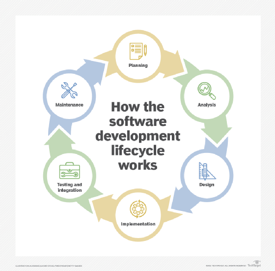

In the past week's experience with typescript, I think the syntax of typescript has a high similarity with python that I learned in this summer, it's my first contact to Typescript, after learning this module, I learn that the code written in Typescript will be compiled into JavaScript code when running in an environment because Typescript is a superset of JavaScript and add some features and some browser does not understand Typescript, Typescript is like JavaScript with types, ES stands for ECMAScript and are interchangeable with JavaScript, with the release of ES6 new features like let, const , arrow functions and modules are introduced, which makes JavaScript more convenient and useful, I think Typescript is a good choice for learning software engineering since its ,,,,,,,

I think the teachers who designed athletic software engineering have a great wisdom, I can experience lots of "design" and "process" problems, I can learn a lot skills that are required for modern software engineering development like JavaScript and typescript and GitHub in the past week, these technology stack are very essential for computer science career. Practicing WODs would definitely help in software engineering even though their are too many homework, this kind of mode of study really requires high ，I feel stressful in the beginning of this course because this is the course with the most homework I have ever taken, but this could not be an excuse, I have to be more efficient and finish all WODs and assignment on time, I think I will be comfortable with this course in a short time.
