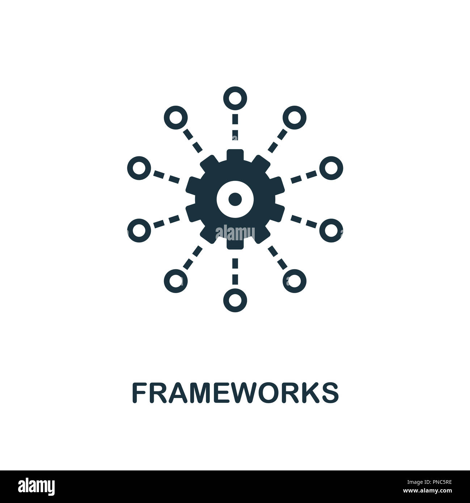

<h1>#Learning UI Frameworks is even more complicated than a programming language!</h1>
When I was first introduced to bootstrap 5 last week I wondered, what is this thing? what is nav? Why do you need the class nav-item in front of some elements? I already learned how to add text in the page using p in HTML, why do I need to learn more in other format? Wouldn't it be redundant for me to learn this when I've already mastered html and css? After the Island Snow assignment, I was surprised when I realized that I can put the logo of facebook company using only a line of code without searching the code from outside resources, I can just copy the code "<i class="bi bi-facebook"></i>" from bootstrap 5 icons library, after that I'm starting to like the frame because it saves me a lot of time to search for outside resouces, 

<h1>#Bootstrap 5 makes development easier!</h1>

<h1>#What can I get from Bootstrap 5 and other UI Frameworks?.</h1>

