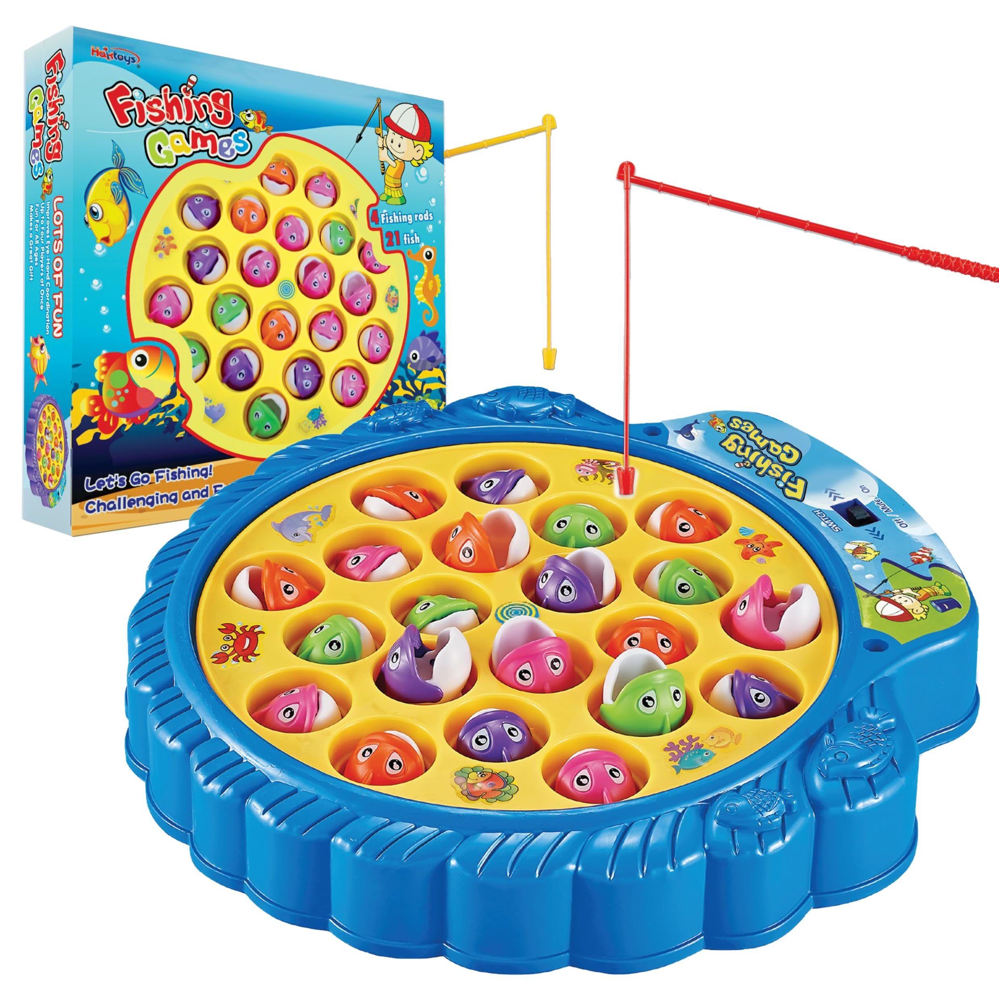

  
  
  

This fishing game is a final project written in Java of ICS 211 at KCC campus, it's a two-player games,each player will have 12 chances to catch fishes in different methods, some methods are not allowed in specific season, which the rule can be printed every time before they starting fishing, and some fishes caught are too small to put in packet, so they need to decide wheter to put the fish in the packet or let the fish go each time, player who use illegal catch method or put illegal fish in the packet will lost the game after 3 times, after 12 catches the player with higher total lenght with be the winner. there are 3 people in the group I'm responsible for classifying the fish classes.

Here is some code that illustrates how we read values from the line sensors:

