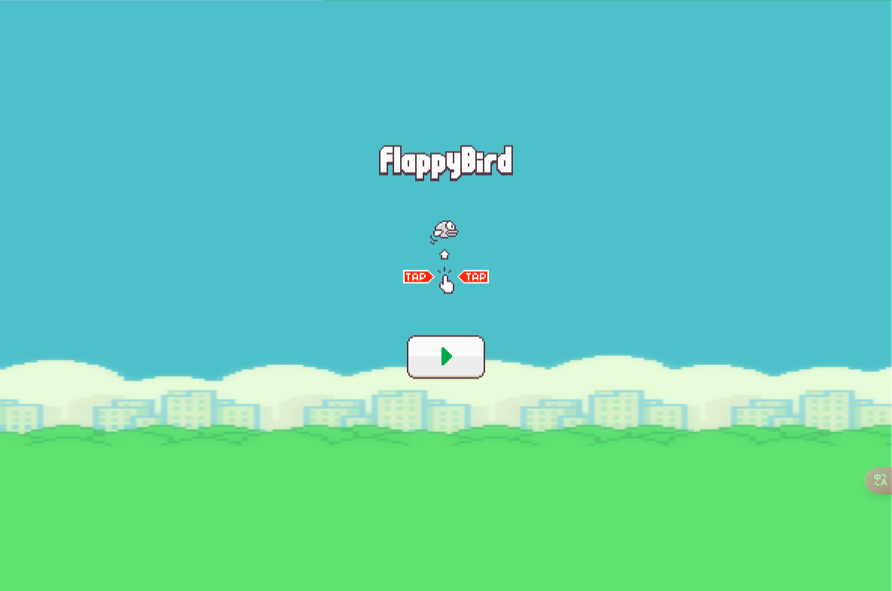

In this project, I developed a small game using Python called Flappy Bird, this is a famous project for python beginner. The player controls a small bird character that keeps flying through the air by constantly tapping the screen or pressing keyboard buttons, and dodging random pipe obstacles that appear above and below. The background is a pixelated blue sky accompanied by moving clouds that add some dynamic effects to the game. The score is displayed at the top of the screen and the player needs to pass through as many pipes as possible without hitting them to get a higher score. During the development process, I learned how to use Pygame to handle physics simulation, collision detection, and simple animation effects. This project not only enhanced my programming skills, but also gave me a deeper understanding of the logic and mechanics of game development.
